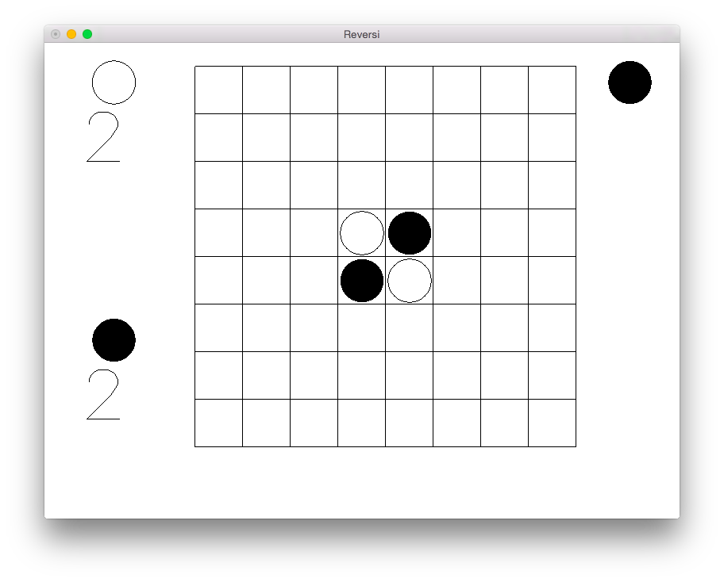

# reversi

[](https://travis-ci.org/cmc-haskell-2015/reversi)

Игра «Реверси».

## Системные требования

### SQLite

#### Windows

Скачать SQLite можно на [официальном сайте](http://www.sqlite.org/download.html).
Вам понадобятся бинарные файлы (Precompiled binaries) для DLL (`sqlite-dll-*`).

Распакуйте скачанный архив в `C:\sqlite` и выполните:

```
$ cd reversi
$ cabal install sqlite --extra-include-dirs=C:\sqlite --extra-lib-dirs=C:\sqlite
```

#### Mac OS X

Проще всего установить SQLite, используя [Homebrew](http://brew.sh):

```
$ brew install sqlite3
```

#### Debian/Ubuntu

Установите SQLite из репозиториев:

```
$ sudo apt-get install sqlite3 libsqlite3-dev
```

## Установка и запуск

Для установки клонируйте репозиторий и запустите `cabal install`:

```
$ git clone https://github.com/cmc-haskell-2015/reversi.git
$ cd reversi
$ cabal install
```

### Графический интерфейс



Запуск графического интерфейса осуществляется командой `reversi`:

```
$ reversi
```

Для сборки и запуска текущей версии непосредственно из репозитория используйте `cabal run`:

```
$ cd reversi
$ cabal run reversi
```

### Интерфейс командной строки

Запуск интерфейса командной строки осуществляется командой `reversi-cli`:

```
$ reversi-cli
Preprocessing executable 'reversi-cli' for reversi-0.1...
Running reversi-cli...
_ _ _ _ _ _ _ _
_ _ _ _ _ _ _ _
_ _ _ _ _ _ _ _
_ _ _ o x _ _ _
_ _ _ x o _ _ _
_ _ _ _ _ _ _ _
_ _ _ _ _ _ _ _
_ _ _ _ _ _ _ _

Move: o
Account: 2:2
Move>
```

Для сборки и запуска текущей версии непосредственно из репозитория используйте `cabal run`:

```
$ cd reversi
$ cabal run reversi-cli
```

## Документация

Автоматическая документация кода сгенерирована при помощи [Haddock](https://www.haskell.org/haddock/).

Онлайн документация доступна здесь: http://cmc-haskell-2015.github.io/reversi/docs/

Локально документацию можно собрать, запустив простую команду:

```
$ cabal haddock
```

